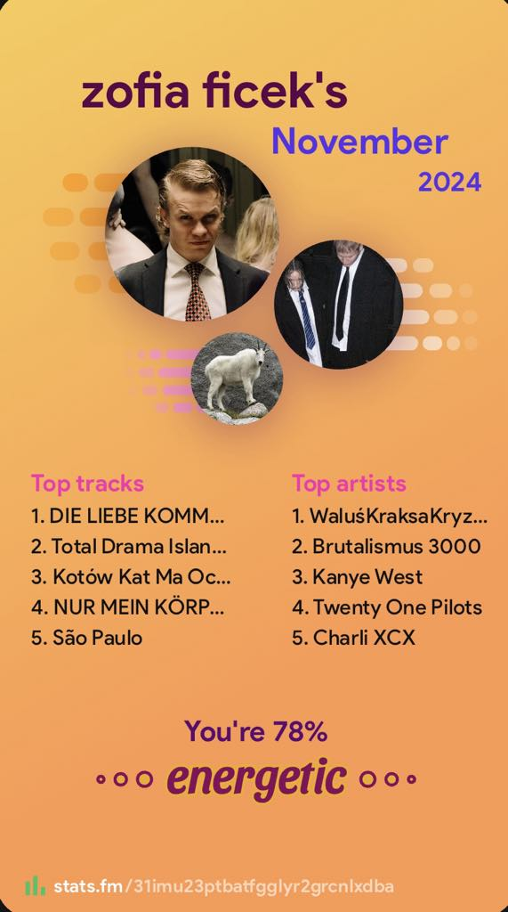
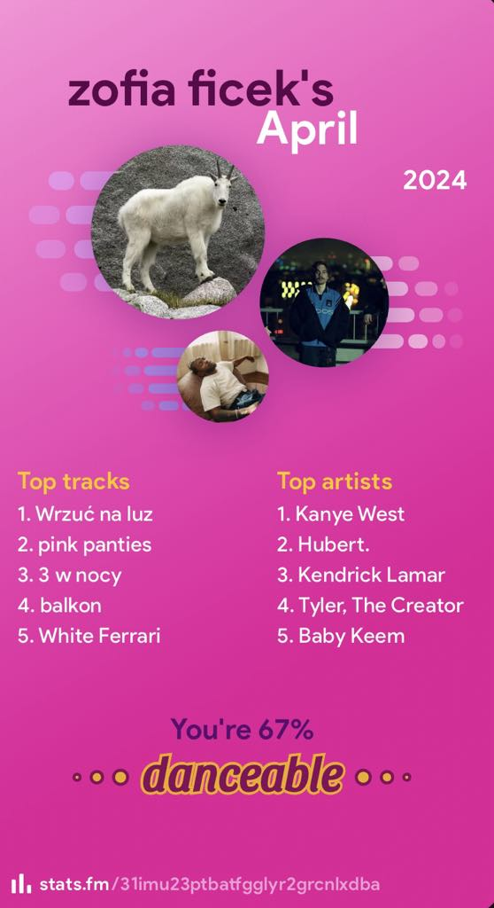
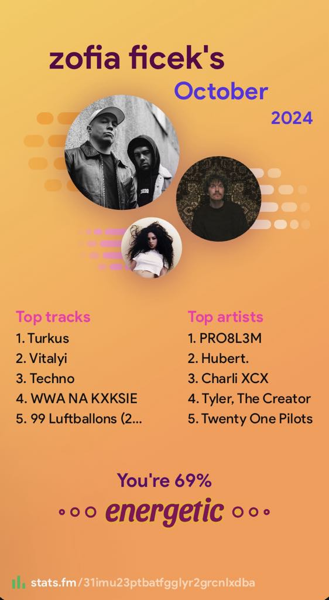

Witaj na mojej stronie stworzonej za pomocą **GitHub Pages** oraz [Jekyll](https://jekyllrb.com/).
## Projekty ##
### [Projekt mojego zespołu PythonKrakowski](https://github.com/2024-2025-AGH-Wstep-do-Informatyki/PythonKrakowski) ###
Ten projekt to hub z prostymi grami stworzonymi w Pythonie za pomocą PyQt5, gdzie głównym motywem jest wąż. Planowo każda gra w hubie będzie zawierać elementy związane z wężami, nawiązując do języka programowania Python. Aktualnie w hubie znajduje sie 9 gier

## O mnie ##
Mogę się określić jako student o niewielkich umiejętnościach, ale dużych możliwościach z nadzieją na ukończenie studiow za 3 lata.

  

Zagorzały fanatyk starej polskiej kinematografii (zwłaszcza Daniela Olbrychskiego), muzyki każdego rodzaju 

  
  
  

i postaci publicznych pokroju Eli Gawin czy Izabeli Kisio-Skorupy. Certyfikowany imigrant wyjeżdzający z kraju przynajmniej 4 razy w roku (i to certyfikowany doslownie bo przez program DiscoverEU). Moją najwiekszą ambicją aktualnie jest zostanie ambasoderem Redbulla, ukończenie kursu barmańskiego i pojechanie do Maroka po zdanej (lub niezdanej) sesji, żeby przejechać się wielbładem. Trochę mniej realnym celem jest pojechanie na Erasmusa do Nepalu.

  

